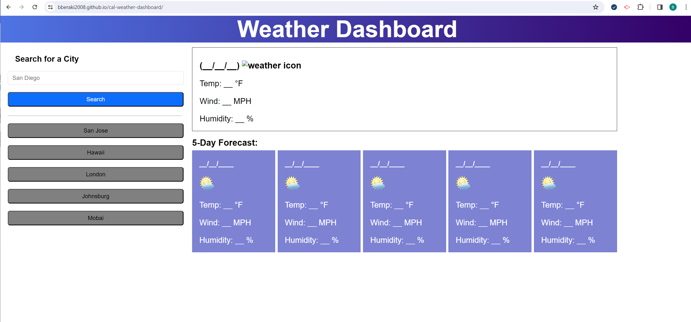

# Cal-weather-dashboard

## Weather Outlook

## Description

This site is crafted for traveler who want to see the weather outlook for multiple cities so that they can plan a trip accordingly.
Travel input their destination city in the input box and search for it and they will be presented with current and future conditions
for that city and that city is added to the search history. WHEN they view current weather conditions for that city
then they will be presented with the city name, the date, an icon representation of weather conditions, the temperature, the humidity, and the wind speed
When they view future weather conditions for that city then they will be presented with a 5-day forecast that displays the date, an icon repr.esentation of weather conditions, the temperature, the wind speed, and the humidity. When they click on a city in the search history they will be again presented with current and future conditions for that city

## Installation

N/A

## Usage

To use this site of weather outlook, you can open it with the most popular browser such as Google Chrome, Firefox (Mozilla), Edge and so on...

## Credits

N/A

## links to the APP

https://bberaki2008.github.io/cal-weather-dashboard/

## Screenshot

## License

Please refer to the LICENSE in the repo.
